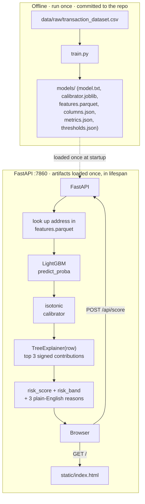
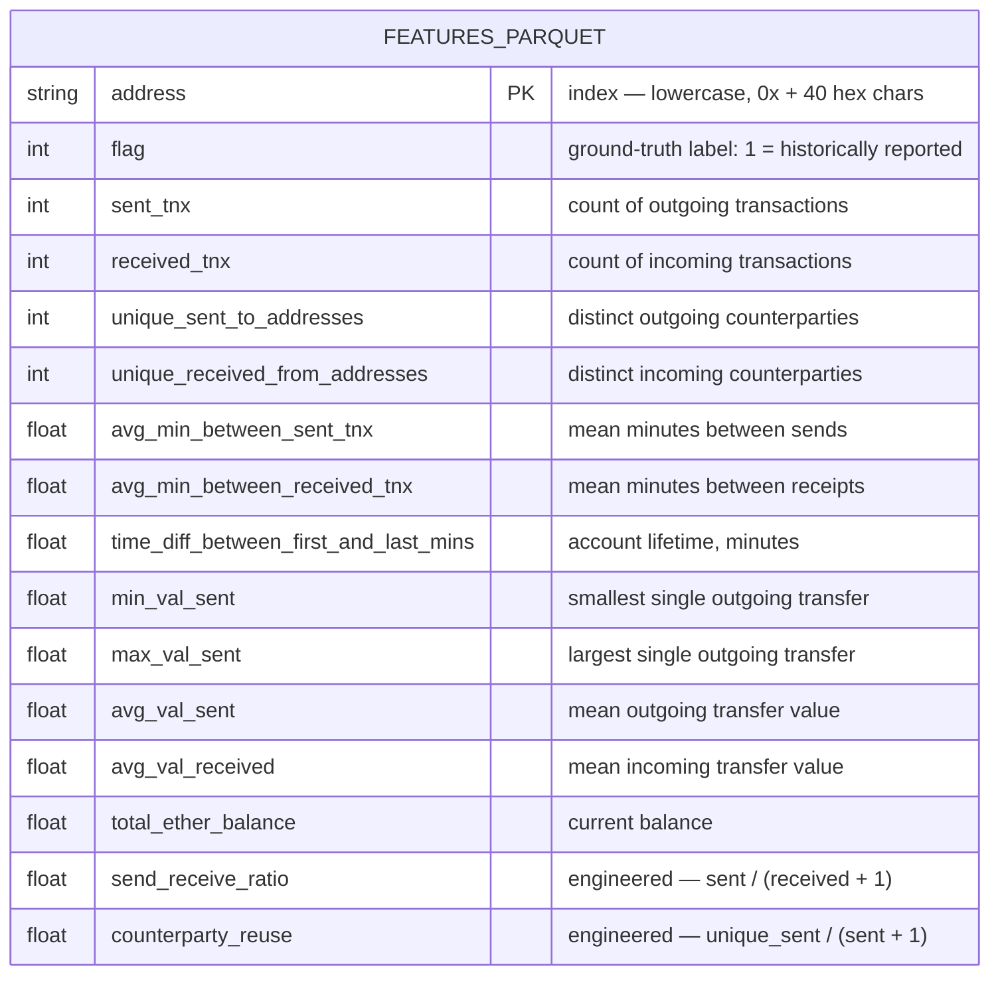

<div align="center">


**Score any Ethereum address for patterns seen in reported scam activity.**

A calibrated LightGBM risk model over 14 on-chain behavioural features, served by FastAPI, explained per-request with SHAP, and shipped as one Docker image.


**[Live demo →](https://chainguard-zxbl.onrender.com/)** — free Render tier: the first request after idle can take ~30–50s to wake the instance.

</div>

---

## Contents

- [Overview](#overview)
- [Screenshots](#screenshots)
- [Features](#features)
- [Tech Stack](#tech-stack)
- [Architecture](#architecture)
- [Model](#model)
- [Project Structure](#project-structure)
- [Getting Started](#getting-started)
- [API](#api)
- [Security](#security)
- [Key Engineering Decisions](#key-engineering-decisions)
- [Testing](#testing)
- [Limitations](#limitations)
- [Roadmap](#roadmap)
- [License](#license)

## Overview

ChainGuard reports **patterns** in publicly reported data — an unusually high send-to-receive ratio, a thin fast-turnover balance, short gaps between outgoing transactions — for a fixed set of ~9,800 Ethereum addresses drawn from a public fraud-detection dataset. It does not accuse anyone of anything, and a risk score is not a final determination; see [Limitations](#limitations) before reading anything into a score.

No build step, no database, no cloud dependency beyond the container itself: one Docker image, one port, a Parquet feature table loaded into memory at startup.

## Screenshots

<table>
<tr><td align="center"><b>Landing</b></td></tr>
<tr><td></td></tr>
<tr><td align="center"><b>App — idle</b></td></tr>
<tr><td></td></tr>
<tr><td align="center"><b>App — result</b></td></tr>
<tr><td></td></tr>
</table>

<details>
<summary>Mobile view (~390px)</summary>
<br>

</details>

## Features

- **Single-address risk scoring.** Paste an address, get a calibrated `risk_score` (rendered as a percentage), a `low`/`medium`/`high` band, and an activity summary — `POST /api/score` in `app/main.py`.
- **Per-request explanations.** A `shap.TreeExplainer` built on the trained LightGBM booster ranks each address's 14 features by `|SHAP value|`; the top 3 are rendered through a fixed table of neutral, observational phrases (`app/scoring.py::FACTS`) — never a name, never an intent.
- **Calibrated, not raw, probabilities.** The LightGBM output is passed through an isotonic regressor (`CalibratedClassifierCV`, `models/calibrator.joblib`) before it's shown, so a score of `0.8` means roughly what it says — see [Model](#model).
- **Data-derived risk bands.** `high`/`medium` cutoffs come from the test-set precision–recall curve (`train.py::derive_thresholds`), not hardcoded round numbers.
- **3D landing screen.** A Three.js scene (loaded as an ES module from a CDN) renders a slowly rotating Ethereum octahedron and Bitcoin coin behind the intro screen; if the module or WebGL is unavailable, it falls back to a CSS radial-gradient background automatically.
- **Single-viewport app.** The scoring screen — search bar, gauge, metrics, reasons, and the disclaimer footer — is laid out as one `dvh`/`clamp()`-sized flex column with no page scroll at typical laptop and phone viewport heights.
- **Shareable results.** A successful score pushes `?address=…` into the URL via `history.replaceState`; opening that link directly skips the landing screen and loads the result immediately.

## Tech Stack

**Backend**
- Python 3.11, FastAPI + Uvicorn
- LightGBM (`LGBMClassifier`) — the risk model
- scikit-learn — `CalibratedClassifierCV` (isotonic calibration), `LogisticRegression` baseline, `StratifiedKFold` CV
- SHAP — `TreeExplainer` for per-request explanations
- pandas + PyArrow — the in-memory feature table (`models/features.parquet`)
- Pydantic — request/response schemas

**Frontend**
- Vanilla HTML/CSS/JS, one file (`static/index.html`), no framework, no build step
- Three.js (CDN ES module) — the landing screen's 3D background only

**Testing / tooling**
- pytest + httpx (`TestClient`) — `tests/test_api.py`
- ruff — linting
- A repo-specific `make lint-language` check (see [Security](#security))

**Infrastructure**
- Docker (`python:3.11-slim`), one image, port 7860
- Deployed on Render, Docker runtime (`render.yaml`, `autoDeploy: true`)

## Architecture



Model, calibrator, explainer, and feature table load once in a FastAPI `lifespan` handler (`app/main.py`) — never per request. There is no database; the feature table is a 9,816-row Parquet file loaded into memory.

## Model

**Data:** the public *Ethereum Fraud Detection* dataset (~9,841 addresses, 51 raw columns, binary `FLAG`). Column names in the source CSV are inconsistently cased and spaced (`min val sent` vs. `min value received`, a stray `Unnamed: 0` index column); `train.py::slugify` normalizes every header to `snake_case` before anything else touches it.

**Features (14):** 12 behavioural columns (transaction counts, timing, value statistics, balance) plus two engineered ratios computed in `train.py::load_clean_frame`:

```
send_receive_ratio  = sent_tnx / (received_tnx + 1)
counterparty_reuse  = unique_sent_to_addresses / (sent_tnx + 1)
```

No ERC-20 token-name columns — they leak label information and don't generalize.

**Pipeline:** dedupe on address → stratified 80/20 split (`random_state=42`) → `LGBMClassifier` (400 trees, `class_weight="balanced"`, no hyperparameter search) → isotonic calibration (`CalibratedClassifierCV`, fit on a held-out 15% slice of train) → thresholds derived from the test-set precision–recall curve.

### Data schema

`models/features.parquet` is the only thing queried per request:



9,816 rows (deduplicated on address), 15 columns. `flag` is carried for the example-chip endpoint but never passed to the model at inference — only the 14 names in `models/columns.json` are.

The rest of `models/` are artifacts from the same `train.py` run, committed together so they can't drift out of sync:

| File | Contents |
|---|---|
| `features.parquet` | the table above |
| `columns.json` | the 14 feature names, in model input order |
| `model.txt` | the LightGBM booster, native text format |
| `calibrator.joblib` | the fitted isotonic regressor |
| `thresholds.json` | `{"medium": ..., "high": ...}`, from the PR curve |
| `metrics.json` | the table below, plus split sizes and `trained_on` |

### Metrics

From `models/metrics.json`, trained **2026-08-21** on 9,816 deduplicated rows (7,852 train / 1,964 test, 22.2% positive in both).

| Metric | Value |
|---|---|
| PR-AUC (primary — classes are imbalanced) | **0.9451** |
| ROC-AUC | 0.9817 |
| Baseline (`LogisticRegression`) PR-AUC | 0.5744 |
| 5-fold CV PR-AUC (train half) | 0.9643 ± 0.0046 |
| Precision@100 | 0.9900 |
| Recall at 90% precision | 0.8624 |
| Brier score, before calibration | 0.0412 |
| Brier score, after calibration | **0.0392** |

LightGBM clears the logistic baseline by 37 points of PR-AUC. Isotonic calibration reduces the Brier score, so a `risk_score` of 0.8 means roughly 80%.

**Confusion matrix** at a 0.5 decision threshold (test set, calibrated scores):

| | Predicted low/medium | Predicted high-risk |
|---|---|---|
| **Actually clean** | 1,491 (tn) | 37 (fp) |
| **Actually flagged** | 64 (fn) | 372 (tp) |

**Band thresholds**, from `models/thresholds.json`: `high = 0.6154`, `medium = 0.3612`. `train.py::derive_thresholds` enforces `high ≥ medium` by construction (the calibrated score distribution is bimodal enough that the raw PR-curve crossings can otherwise come out inverted).

### Explanations

Each score carries the top 3 SHAP contributions (`TreeExplainer`, exact for trees), rendered through a fixed 14-feature × 2-direction phrase table in `app/scoring.py::FACTS`. Every phrase describes behaviour, not intent.

## Project Structure

```
app/
├── main.py        # FastAPI app: 5 routes, lifespan model loading, error handling
├── schemas.py      # Pydantic request/response models
└── scoring.py      # ModelBundle: loads artifacts once, scores a single address

static/
└── index.html      # entire frontend — landing screen + scoring app, one file

models/              # committed training artifacts (see Data schema above)
data/raw/            # gitignored except .gitkeep; the CSV is not committed
tests/
└── test_api.py      # 3 tests: valid score, malformed address, unknown address

train.py             # the one training script — see Model
Dockerfile
Makefile
render.yaml
```

## Getting Started

### Prerequisites

- Python 3.11
- The dataset CSV at `data/raw/transaction_dataset.csv` (only needed to run `make train` yourself — `models/` is already committed)

No environment variables are required; the app reads no configuration from the environment.

### Installation

```bash
make setup   # python -m venv .venv && pip install -r requirements.txt
```

### Development

```bash
make serve   # uvicorn app.main:app --reload --port 7860
```

### Reproducing the model

```bash
make train   # python train.py — writes models/, prints metrics
```

`models/` is already committed; `make train` is only needed to reproduce the artifacts yourself. The container never trains — `make docker` installs and serves the artifacts already in the repo.

### Docker

```bash
make docker  # docker build -t chainguard . && docker run -p 7860:7860 chainguard
```

## API

| Method | Route | Purpose |
|---|---|---|
| `GET` | `/` | the frontend (`static/index.html`) |
| `POST` | `/api/score` | `{"address": "0x..."}` → score, band, top 3 reasons, activity summary |
| `GET` | `/api/model/info` | metrics + thresholds + training date + row count |
| `GET` | `/api/examples` | 3 real dataset addresses (1 flagged, 2 not), labels hidden |
| `GET` | `/health` | `{"status": "up"}` |

Validation: a malformed address returns `422`; a well-formed address not in the demo dataset returns `404`; if the model artifacts are missing, the scoring routes return `503`. Full request/response shapes are in [`app/schemas.py`](app/schemas.py) and documented live at `/docs`.

<details>
<summary><code>POST /api/score</code> example</summary>

```bash
curl -X POST localhost:7860/api/score \
  -H "Content-Type: application/json" \
  -d '{"address":"0x0020731604c882cf7bf8c444be97d17b19ea4316"}'
```

```json
{
  "address": "0x0020731604c882cf7bf8c444be97d17b19ea4316",
  "risk_score": 1.0,
  "risk_band": "high",
  "top_reasons": [
    {"fact": "Receives from a very large number of distinct addresses", "weight": 3.4648, "direction": "raises"},
    {"fact": "Short total lifetime of activity", "weight": 2.6693, "direction": "raises"},
    {"fact": "Very short gaps between incoming transactions", "weight": 1.6234, "direction": "raises"}
  ],
  "activity": {"sent": 3, "received": 13, "unique_counterparties": 13, "lifetime_days": 3},
  "disclaimer": "Risk scores describe patterns in publicly reported data. They are not an accusation and not financial advice."
}
```
</details>

## Security

There is no authentication and no user accounts — the API is public and read-only. There is nothing to authenticate: it scores addresses against a fixed, pre-computed table and takes no address-specific input beyond the lookup key.

- **Input validation:** `POST /api/score` validates the address against `^0x[a-fA-F0-9]{40}$` (`app/schemas.py::ADDRESS_PATTERN`) before it reaches the model.
- **No persistence:** requests aren't logged to a database or file; each score is computed fresh from the in-memory table and returned.
- **No secrets:** the app reads no environment variables and holds no API keys or credentials — nothing to leak, no `.env` file exists in the repo.
- **Content discipline, enforced at CI time:** `make lint-language` greps the repo for a fixed list of accusatory terms (the pattern lives in the `Makefile`) and fails the build on any hit outside `claude.md`. This isn't a security control in the traditional sense, but it's a real, automated constraint on what the project is allowed to say about the people behind an address.

## Key Engineering Decisions

**Problem:** duplicate addresses landing in both the train and test split would inflate every reported metric.
**Decision:** deduplicate on `address` before splitting (`train.py::load_clean_frame`).
**Reason:** on a 9.8k-row dataset, even a small number of duplicate rows crossing the split is the single biggest source of fake accuracy.
**Result:** 25 duplicates dropped before any split happens; the reported PR-AUC reflects addresses the model has genuinely never seen.

**Problem:** an uncalibrated GBM's `predict_proba` output isn't a probability in any meaningful sense — it's a score that happens to lie in `[0, 1]`.
**Decision:** wrap the fitted LightGBM in `CalibratedClassifierCV(method="isotonic")`, fit on a held-out 15% slice of train, and gate the whole run on the Brier score actually improving.
**Reason:** the UI presents `risk_score` as a probability-like percentage; showing that number without calibration would be misleading regardless of how the interface looks.
**Result:** Brier score 0.0412 → 0.0392; if calibration hadn't improved it, `train.py` raises `SystemExit` rather than shipping the artifacts.

**Problem:** the calibrated score distribution is bimodal (most addresses land near 0 or 1), so the two independent PR-curve crossings used to derive `medium` and `high` can come out with `medium` above `high`.
**Decision:** `derive_thresholds` computes both crossings from the curve, then assigns the larger to `high` and the smaller to `medium` by construction.
**Reason:** an inverted or empty middle band would make the UI's 3-tier risk pill nonsensical for some fraction of addresses.
**Result:** `high ≥ medium` is guaranteed regardless of how the curve behaves, and both numbers still come directly off the data.

**Problem:** a genuine 3D scene (Three.js) is the only way to deliver the requested motion background, but the rest of the project is deliberately dependency-free and must not break if a CDN is unreachable.
**Decision:** load Three.js as an ES module from a CDN inside a `try/catch`; on any failure (network, WebGL unavailable), add a `.no-3d` class that switches to a pure-CSS animated gradient background instead.
**Reason:** the landing screen is a first impression, not a load-bearing part of the product — it should degrade, not break the page.
**Result:** the app screen (search, scoring, results) has zero dependency on the 3D module succeeding.

## Testing

```bash
make test    # pytest -q
make lint    # ruff check . && make lint-language
make check   # lint + test
```

`tests/test_api.py` — 3 tests, using `TestClient` against the real FastAPI app with real model artifacts (no mocking): a valid address returns a score in `[0, 1]` with exactly 3 reasons; a malformed address returns `422`; a well-formed but absent address returns `404`.

## Limitations

- **Deduplicated, not temporal.** Duplicate addresses are removed before splitting train/test, but the dataset carries no timestamps, so the split is a random 80/20, not a time-aware one — there's no way to simulate whether this would have flagged something before it happened.
- **Labels are noisy.** They come from historical reports of scam activity: incomplete, skewed toward addresses someone bothered to report, and not independently verified. A low score means the pattern wasn't in this data, not that an address is safe.
- **Fixed demo table.** Scoring only works for the ~9,816 addresses in `models/features.parquet`. An address outside that set returns `404` — this build does not fetch live on-chain data (see [Roadmap](#roadmap)).
- **A score is a pattern match, not a determination.** It describes behavioural similarity to historically reported activity. It is not an accusation and not financial advice.

## Roadmap

- [x] Calibrated LightGBM risk model with SHAP explanations
- [x] FastAPI backend, 5 routes, in-memory feature table
- [x] Single-file frontend: 3D landing screen, single-viewport scoring app
- [x] Docker image, deployed on Render
- [ ] Live on-chain lookup for addresses outside the demo dataset — pull an address's `txlist` from an Etherscan-style API, derive the same 14 features from the raw transactions, and score it, falling back to the current 404 when no API key is configured. Not implemented; the feature-derivation logic would need to be factored into a function shared with `train.py` so the two pipelines can't drift apart.

## License

[MIT](LICENSE)
