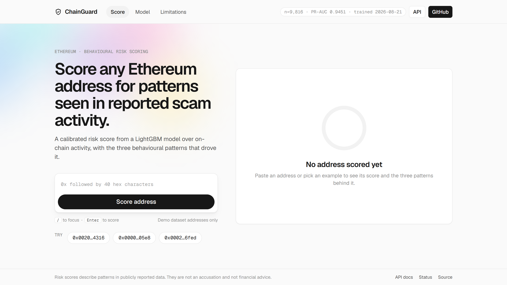
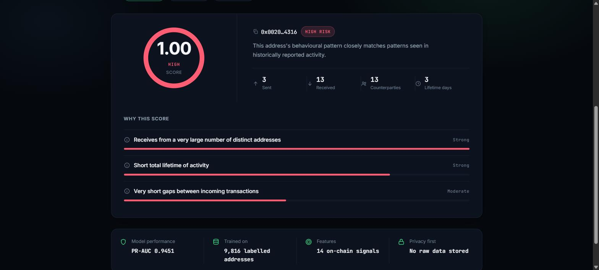
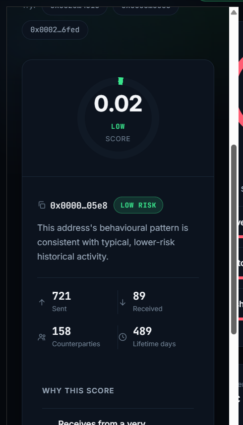
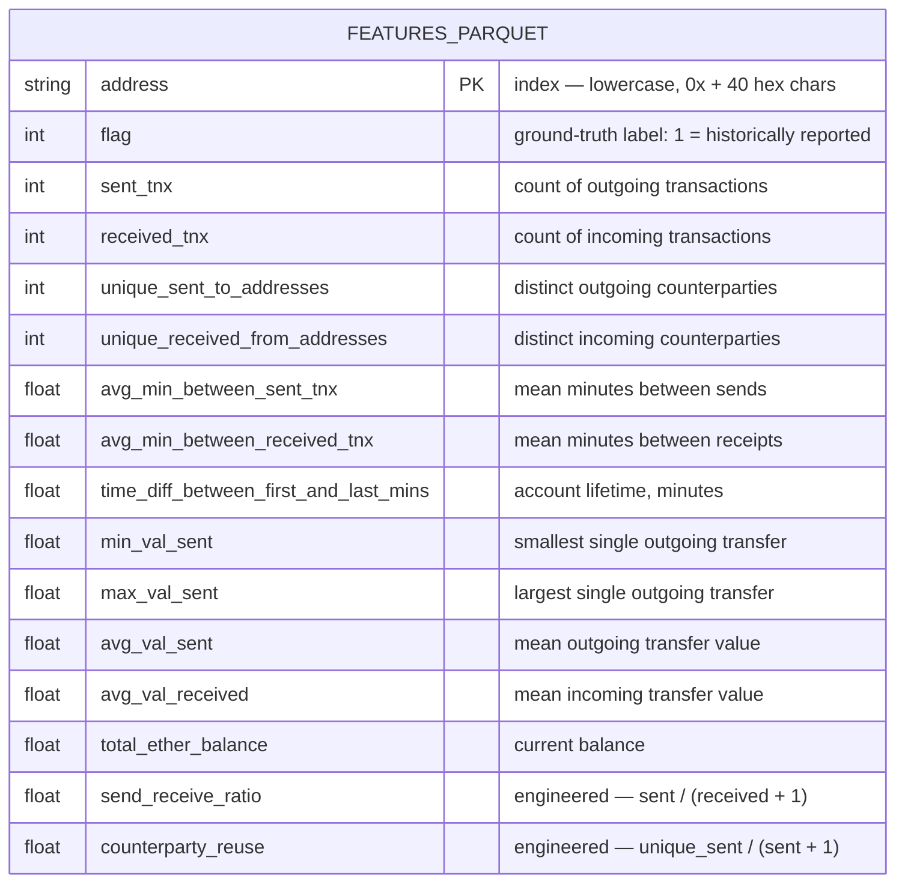

<div align="center">


**Score any Ethereum address for patterns seen in reported scam activity.**

Paste an address, get a calibrated risk score with the three behavioural patterns that drove it — a LightGBM model over on-chain activity features, served by FastAPI, shipped as one Docker image.


**[Live demo →](https://chainguard-zxbl.onrender.com/)** — free Render tier: the first request after idle can take ~30-50s to wake the instance.

</div>

---

## Contents

- [Overview](#overview)
- [Screenshots](#screenshots)
- [Quickstart](#quickstart)
- [Architecture](#architecture)
- [Model](#model)
- [API](#api)
- [Limitations](#limitations)
- [Development](#development)
- [License](#license)

## Overview

ChainGuard reports **patterns** in publicly reported data — an unusually high send-to-receive ratio, a thin, fast-turnover balance, short gaps between outgoing transactions. It does not accuse anyone of anything, and a risk score is not a final determination. See [Limitations](#limitations) before reading anything into a score.

No build step, no database, no cloud dependency: one Docker image, one port, a Parquet table loaded into memory.

**Interface:** a dark security-dashboard theme — restrained neon-green accent against near-black surfaces, monospace for every address/hash/metric, risk color reserved strictly for the gauge and the risk pill (never decorative). Vanilla HTML/CSS/JS, one file, no framework.

## Screenshots

<table>
<tr><td align="center"><b>Idle</b></td></tr>
<tr><td></td></tr>
<tr><td align="center"><b>Result</b></td></tr>
<tr><td></td></tr>
</table>

<details>
<summary>360px responsive view</summary>
<br>

</details>

## Quickstart

Four commands, from a clean checkout:

```bash
make setup   # python -m venv .venv && pip install -r requirements.txt
make train   # trains the model, writes models/, prints metrics
make serve   # uvicorn app.main:app --reload --port 7860
make docker  # docker build -t chainguard . && docker run -p 7860:7860 chainguard
```

`models/` is already committed — `make train` is only needed to reproduce the artifacts yourself. `make docker` never trains; it installs and serves the artifacts already in the repo.

## Architecture

```mermaid
flowchart TD
    subgraph Offline["Offline · run once · committed to the repo"]
        A["data/raw/transaction_dataset.csv"] --> B["train.py"]
        B --> C["models/ &#40;model.txt, calibrator.joblib,<br/>features.parquet, thresholds.json&#41;"]
    end

    subgraph Runtime["FastAPI :7860 · artifacts loaded once, in lifespan"]
        D["Browser"] -- "GET /" --> E["static/index.html"]
        D -- "POST /api/score" --> F["FastAPI"]
        F --> G["look up address in<br/>features.parquet"]
        G --> H["LightGBM<br/>predict_proba"]
        H --> I["isotonic<br/>calibrator"]
        I --> J["TreeExplainer&#40;row&#41;<br/>top 3 signed contributions"]
        J --> K["risk_score + risk_band<br/>+ 3 plain-English reasons"]
        K --> D
    end

    C -. loaded once at startup .-> F
```



Model, calibrator, explainer and feature table load once, in a FastAPI `lifespan` handler — never per request. No database: the feature table is a 9,816-row Parquet file loaded into memory at startup.

## Model

**Data:** the public *Ethereum Fraud Detection* dataset (~9,841 addresses, 51 raw columns, binary `FLAG`). Column names in the source CSV are inconsistently cased and spaced (`min val sent` vs. `min value received`, a stray `Unnamed: 0` index column); `train.py` slugifies every header to `snake_case` before anything else touches it — no raw column name is hand-typed anywhere else in the repo.

**Features:** 12 behavioural columns (transaction counts, timing, value statistics, balance) plus two engineered ratios — `send_receive_ratio` and `counterparty_reuse` — 14 in total. No ERC20 token-name columns: they leak and don't generalise.

**Pipeline:** dedupe on address → stratified 80/20 split (`random_state=42`) → `LGBMClassifier` (400 trees, `class_weight="balanced"`, no hyperparameter search) → isotonic calibration (`CalibratedClassifierCV`, fit on a held-out 15% slice of train) → thresholds derived from the test-set precision-recall curve.

### Data schema

There is no database — by design (§1). `train.py` writes one flat feature table, `models/features.parquet`, loaded into memory once at startup and looked up by address. This is its full schema:



9,816 rows, one row per deduplicated address, 15 columns (14 model features + `flag`). `flag` is carried in the table for building the example chips (`GET /api/examples`) but is never passed to the model at inference time — only `models/columns.json`'s 14 names are.

The rest of `models/` are the artifacts this table is scored against, all produced by the same `train.py` run and committed together so they never drift out of sync:

| File | Contents |
|---|---|
| `features.parquet` | the table above — the only thing queried per request |
| `columns.json` | the 14 feature names, in the exact order the model expects them |
| `model.txt` | the LightGBM booster, native text format |
| `calibrator.joblib` | the fitted isotonic regressor (`raw score → calibrated risk_score`) |
| `thresholds.json` | `{"medium": ..., "high": ...}`, derived from the PR curve (§4.5) |
| `metrics.json` | everything in the [Metrics](#metrics) table below, plus split sizes and `trained_on` |

### Metrics

Every number below comes straight from `models/metrics.json`, produced by `train.py`. Trained on **2026-08-21**, 9,816 deduplicated rows (7,852 train / 1,964 test, 22.2% positive in both).

| Metric | Value |
|---|---|
| PR-AUC (primary — classes are imbalanced) | **0.9451** |
| ROC-AUC | 0.9817 |
| Baseline (LogisticRegression) PR-AUC | 0.5744 |
| 5-fold CV PR-AUC (train half) | 0.9643 ± 0.0046 |
| Precision@100 | 0.9900 |
| Recall at 90% precision | 0.8624 |
| Brier score, before calibration | 0.0412 |
| Brier score, after calibration | **0.0392** |

LightGBM clears the logistic baseline by 37 points of PR-AUC — the features carry real signal, not just class imbalance. Isotonic calibration reduces the Brier score, so a `risk_score` of 0.8 means roughly what it says.

**Confusion matrix** at a 0.5 decision threshold (test set, calibrated scores):

| | Predicted low/medium | Predicted high-risk |
|---|---|---|
| **Actually clean** | 1,491 (tn) | 37 (fp) |
| **Actually flagged** | 64 (fn) | 372 (tp) |

**Band thresholds**, derived from the test-set precision-recall curve — never hardcoded:

- `high` = **0.6154** — the score above which precision is at least 90%.
- `medium` = **0.3612** — the score above which recall is still at least 80%.

These land with `high > medium`, as expected, but the raw crossings aren't guaranteed to come out ordered that way on a bimodal score distribution like this one — `train.py` enforces `high ≥ medium` by construction (see the comment in `derive_thresholds()`).

### Explanations

Each score comes with the top 3 SHAP contributions (`TreeExplainer`, exact for trees) rendered through a fixed fact table — one neutral, observational phrase per feature per direction (28 phrases total, both directions of all 14 features). No phrase names a person or an intent.

## API

| Route | Description |
|---|---|
| `GET /` | the UI |
| `POST /api/score` | `{"address": "0x..."}` → score, band, top 3 reasons, activity summary |
| `GET /api/model/info` | metrics + thresholds + training date + row count |
| `GET /api/examples` | 3 real dataset addresses (1 flagged, 2 not), labels hidden |
| `GET /health` | `{"status": "up"}` |

Validation: a malformed address returns `422`; a well-formed address not in the demo dataset returns `404`; if the model artifacts are missing, every scoring route returns `503`. Full request/response shapes are in [`app/schemas.py`](app/schemas.py) and documented live at `/docs`.

<details>
<summary><code>POST /api/score</code> example</summary>

```bash
curl -X POST localhost:7860/api/score \
  -H "Content-Type: application/json" \
  -d '{"address":"0x0020731604c882cf7bf8c444be97d17b19ea4316"}'
```

```json
{
  "address": "0x0020731604c882cf7bf8c444be97d17b19ea4316",
  "risk_score": 1.0,
  "risk_band": "high",
  "top_reasons": [
    {"fact": "Receives from a very large number of distinct addresses", "weight": 3.4648, "direction": "raises"},
    {"fact": "Short total lifetime of activity", "weight": 2.6693, "direction": "raises"},
    {"fact": "Very short gaps between incoming transactions", "weight": 1.6234, "direction": "raises"}
  ],
  "activity": {"sent": 3, "received": 13, "unique_counterparties": 13, "lifetime_days": 3},
  "disclaimer": "Risk scores describe patterns in publicly reported data. They are not an accusation and not financial advice."
}
```
</details>

## Limitations

- **Deduplicated, not temporal.** Addresses are deduplicated before splitting train/test — duplicate rows landing on both sides is the single biggest source of fake accuracy on a dataset this size. The dataset carries no timestamps, so the split is a random 80/20, not a time-aware one; there is no way to simulate whether this would have flagged something before it happened.
- **Labels are noisy.** They come from historical reports of scam activity: incomplete, skewed toward addresses someone bothered to report, and not independently verified. A low score means the pattern wasn't in this data, not that an address is safe.
- **Fixed demo table.** Scoring only works for the ~9,816 addresses in `models/features.parquet`. An address outside that set returns `404` — this build does not fetch live on-chain data.
- **A score is a pattern match, not a determination.** It describes behavioural similarity to historically reported activity. It is not an accusation and not financial advice.

## Development

```bash
make lint   # ruff check . && make lint-language
make test   # pytest -q  (3 tests: valid score, malformed address, unknown address)
make check  # lint + test
```

`make lint-language` greps the repo for a fixed list of accusatory words (the pattern lives in the Makefile) and fails the build on any hit outside `claude.md` — this project reports patterns, it doesn't accuse.

**Stack:** Python 3.11 · LightGBM + isotonic calibration · SHAP `TreeExplainer` · FastAPI + Uvicorn · a Parquet feature table (no database) · vanilla HTML/CSS/JS (no build step) · one `python:3.11-slim` Docker image on port 7860.

## License

[MIT](LICENSE)
